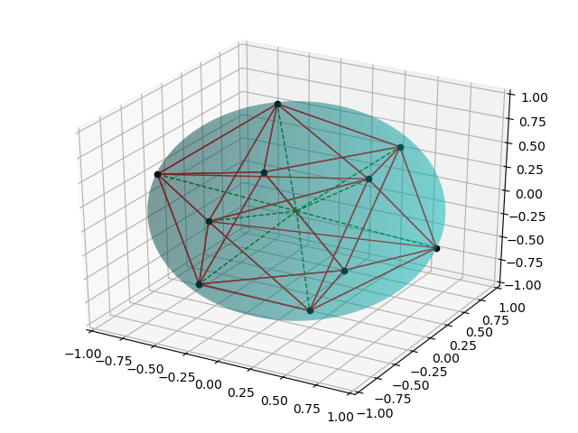

# points-in-3d
Put some points on a parametrized 3d shape, iteratively maximizing the Euclidean distance between them.

Gradient descent algorithm iteratively minimizes the sum of the squared inverses between points in 3-space.

Uses Julia's nifty ForwardDiff gradient calculation.

The script as set up places the points on a sphere. The parametrize function can be changed as desired.

Parameter for the user to play around with: 
 - **n** - number of points
 - **iterations** - number of iterations

The main functionality is in **points.jl**. **plot_points.py** is a helper function in Python for generating the graphs. For anyone interested in trying this, I'd suggest first running **plot_points.py** to make sure the dependencies are met, then **points.jl** (to me, sometimes the Julia errors are a little opaque).
